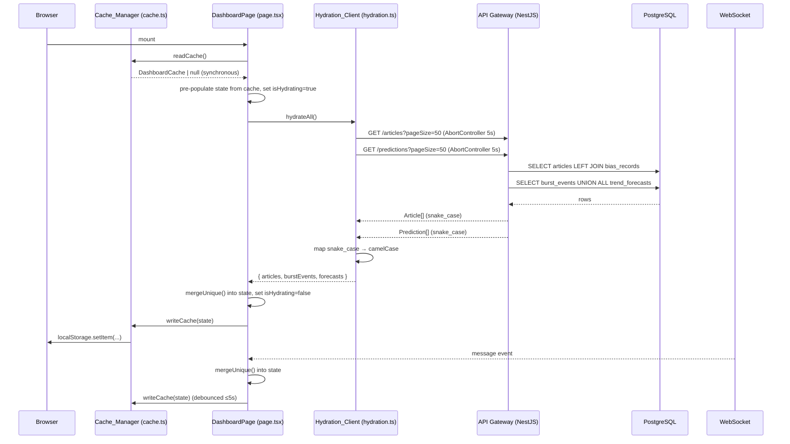

# Design Document: Dashboard Data Persistence

## Overview

The dashboard currently holds all data in React component state, which is lost on every page refresh or new tab. This feature adds two complementary persistence layers so that users see content immediately on load:

1. **localStorage snapshot cache** — written after each successful hydration or WebSocket update, read synchronously on mount to pre-populate state before any network call completes.
2. **API hydration** — on mount, the dashboard fetches the 50 most recent articles and 50 most recent predictions from the existing REST endpoints on the API Gateway, then merges the results into state.

Live WebSocket updates continue to arrive and are merged into the hydrated state using a deduplication helper that prevents duplicate records from appearing.

A secondary change is required in the API Gateway: the `GET /articles` endpoint currently returns articles without bias scores. It will be updated to LEFT JOIN `bias_records` so that each article carries `bias_score` and `bias_label`, enabling the bias heatmap to render correctly from hydrated data.

### Design Goals

- **Zero blank-screen time**: cache read is synchronous and happens before the first render paint.
- **Graceful degradation**: fetch failures are silent — the dashboard continues to work with cached or WebSocket data.
- **No new dependencies**: `fast-check` is already in devDependencies; no new packages are needed.
- **Minimal surface area**: two new files (`hydration.ts`, `cache.ts`) and targeted edits to `page.tsx` and `articles.service.ts`.

---

## Architecture



### Component Relationships

```mermaid
graph TD
    A[page.tsx] -->|reads/writes| B[cache.ts — Cache_Manager]
    A -->|calls on mount| C[hydration.ts — Hydration_Client]
    C -->|fetch| D[API Gateway /articles]
    C -->|fetch| E[API Gateway /predictions]
    D -->|LEFT JOIN| F[PostgreSQL articles + bias_records]
    E -->|UNION ALL| G[PostgreSQL burst_events + trend_forecasts]
    A -->|mergeUnique helper| H[pure merge function]
    A -->|WebSocket| I[websocket.ts — getSocket()]
```

---

## Components and Interfaces

### New File: `dashboard-ui/src/lib/hydration.ts`

The `Hydration_Client` module is responsible for fetching initial data from the API Gateway and mapping the snake_case API response fields to the camelCase types used internally by the dashboard.

```typescript
// Raw API response shapes (snake_case from the API Gateway)
interface RawArticle {
  article_id: string;
  source_url: string;
  title: string;
  body: string;
  source_name: string;
  published_at: string;
  schema_version: string;
  ingested_at: string;
  bias_score: number | null;
  bias_label: string | null;
}

interface RawPrediction {
  type: 'burst_event' | 'trend_forecast';
  id: string;
  topic_name: string;
  created_at: string;
  // burst_event fields
  article_count?: number | null;
  window_start?: string | null;
  window_end?: string | null;
  // trend_forecast fields
  predicted_volume?: number | null;
  confidence_score?: number | null;
  forecast_horizon?: string | null;
}

interface HydrationResult {
  articles: Article[];
  burstEvents: BurstEvent[];
  forecasts: TrendForecast[];
}

// Public API
export function mapArticle(raw: RawArticle): Article;
export function mapBurstEvent(raw: RawPrediction): BurstEvent;
export function mapTrendForecast(raw: RawPrediction): TrendForecast;
export async function hydrateAll(signal?: AbortSignal): Promise<HydrationResult>;
```

**Mapping rules:**

| API field (snake_case) | Internal field (camelCase) | Default if null/absent |
|---|---|---|
| `article_id` | `articleId` | `''` |
| `title` | `title` | `'Untitled'` |
| `source_name` | `sourceName` | `'Unknown'` |
| `published_at` | `publishedAt` | `new Date().toISOString()` |
| `bias_score` | `biasScore` | `null` |
| `id` (burst) | `eventId` | `''` |
| `topic_name` | `topicName` | `''` |
| `article_count` | `articleCount` | `0` |
| `window_start` | `windowStart` | `''` |
| `window_end` | `windowEnd` | `''` |
| `created_at` (burst) | `detectionTimestamp` | `new Date().toISOString()` |
| `id` (forecast) | `forecastId` | `''` |
| `predicted_volume` | `predictedVolume` | `0` |
| `confidence_score` | `confidenceScore` | `0` |
| `forecast_horizon` | `forecastHorizon` | `''` |

These defaults match exactly what the WebSocket message handler in `page.tsx` uses for missing fields, ensuring structural identity between hydrated and WebSocket-sourced records.

`hydrateAll` fires two `fetch` calls in parallel using `Promise.allSettled`. Each call uses an `AbortController` with a 5-second timeout. Errors are caught, logged to `console.error`, and result in an empty array for that data type — they are never re-thrown.

### New File: `dashboard-ui/src/lib/cache.ts`

The `Cache_Manager` module handles reading and writing the localStorage snapshot.

```typescript
const CACHE_KEY = 'ainews_dashboard_cache';
const CACHE_TTL_MS = 24 * 60 * 60 * 1000; // 24 hours
const MAX_ARTICLES = 50;
const MAX_BURST_EVENTS = 20;
const MAX_FORECASTS = 50;

interface DashboardCache {
  version: 1;
  savedAt: string; // ISO 8601 timestamp
  articles: Article[];       // max 50
  burstEvents: BurstEvent[]; // max 20
  forecasts: TrendForecast[]; // max 50
}

// Public API
export function readCache(): DashboardCache | null;
export function writeCache(data: Omit<DashboardCache, 'version' | 'savedAt'>): void;
export function clearCache(): void;
```

**`readCache` logic:**
1. Call `localStorage.getItem(CACHE_KEY)`. If `null`, return `null`.
2. Attempt `JSON.parse`. If it throws, call `clearCache()` and return `null`.
3. Validate that the parsed object has `version === 1` and a parseable `savedAt`. If not, call `clearCache()` and return `null`.
4. Check `Date.now() - new Date(savedAt).getTime() > CACHE_TTL_MS`. If expired, call `clearCache()` and return `null`.
5. Return the parsed `DashboardCache`.

**`writeCache` logic:**
1. Slice input arrays to their respective limits before serializing.
2. Construct a `DashboardCache` with `version: 1` and `savedAt: new Date().toISOString()`.
3. Call `localStorage.setItem(CACHE_KEY, JSON.stringify(cache))`. Wrap in try/catch to handle `QuotaExceededError` silently.

### Modified File: `dashboard-ui/src/app/page.tsx`

The page component gains:

- `isHydrating: boolean` state (default `true` on mount).
- A `useEffect` that runs once on mount:
  1. Reads cache synchronously via `readCache()` and pre-populates `articles`, `burstEvents`, `forecasts` state.
  2. Calls `hydrateAll()` with an `AbortController` signal.
  3. On settlement (`Promise.allSettled`), merges results into state using `mergeUnique`, sets `isHydrating = false`, and writes the updated state to cache via `writeCache`.
- A debounced cache write (≤5 seconds) triggered whenever the WebSocket handler updates state.
- A `mergeUnique` helper (pure function, defined in the same file or a shared util):

```typescript
function mergeUnique<T>(
  existing: T[],
  incoming: T[],
  key: keyof T,
  limit: number,
): T[]
```

Prepends items from `incoming` whose `key` value does not already appear in `existing`, then slices the combined array to `limit`.

**Header loading indicator:**

```tsx
{isHydrating && (
  <span className="text-xs text-gray-400 animate-pulse">Refreshing…</span>
)}
```

The indicator is shown even when cache data is already displayed, to signal that fresher data is being fetched.

### Modified File: `api-gateway/src/articles/articles.service.ts`

The `getArticles` method is updated to LEFT JOIN `bias_records` and return the most recent bias record per article:

```sql
SELECT
  a.article_id,
  a.source_url,
  a.title,
  a.body,
  a.source_name,
  a.published_at,
  a.schema_version,
  a.ingested_at,
  br.bias_score,
  br.bias_label
FROM articles a
LEFT JOIN LATERAL (
  SELECT bias_score, bias_label
  FROM bias_records
  WHERE article_id = a.article_id
  ORDER BY analysis_timestamp DESC
  LIMIT 1
) br ON true
ORDER BY a.published_at DESC
LIMIT $1 OFFSET $2
```

The `LATERAL` subquery ensures only the most recent bias record per article is joined, avoiding row multiplication. Articles with no bias record receive `bias_score: null` and `bias_label: null`.

The `Article` interface in `articles.service.ts` is extended:

```typescript
export interface Article {
  article_id: string;
  source_url: string;
  title: string;
  body: string;
  source_name: string;
  published_at: string;
  schema_version: string;
  ingested_at: string;
  bias_score: number | null;   // NEW
  bias_label: string | null;   // NEW
}
```

No changes are needed to `articles.controller.ts` — it already returns the `Article` type from the service.

---

## Data Models

### `DashboardCache` (localStorage)

```typescript
interface DashboardCache {
  version: 1;                  // schema version for future migrations
  savedAt: string;             // ISO 8601, used for TTL check
  articles: Article[];         // max 50, ordered by publishedAt DESC
  burstEvents: BurstEvent[];   // max 20, ordered by detectionTimestamp DESC
  forecasts: TrendForecast[];  // max 50, ordered by forecastHorizon DESC
}
```

Storage key: `ainews_dashboard_cache`

### In-Memory State Limits

| Data type | In-memory limit | Cache limit |
|---|---|---|
| `Article` | 200 | 50 |
| `BurstEvent` | 20 | 20 |
| `TrendForecast` | 50 | 50 |

The in-memory limit for articles (200) is higher than the cache limit (50) because WebSocket updates accumulate over a session. The cache only stores the most recent 50 to keep localStorage writes fast and the stored payload small.

### `mergeUnique<T>` Contract

```
mergeUnique(existing, incoming, key, limit):
  result = [
    ...incoming.filter(i => !existing.some(e => e[key] === i[key])),
    ...existing
  ].slice(0, limit)
```

- New items are prepended (most recent first).
- Existing items are retained unchanged.
- Result is capped at `limit`.
- The function is pure (no side effects).

---

## Correctness Properties

*A property is a characteristic or behavior that should hold true across all valid executions of a system — essentially, a formal statement about what the system should do. Properties serve as the bridge between human-readable specifications and machine-verifiable correctness guarantees.*

The project already includes `fast-check` (v3.20.0) in `dashboard-ui/devDependencies`. All property tests will use `fast-check` and run a minimum of 100 iterations each.

**Property Reflection:**

Before listing properties, redundancy is eliminated:
- Requirements 2.1, 2.3, and 2.4 all describe the same deduplication invariant for different types. Since `mergeUnique` is generic, a single property parameterized over the key field covers all three.
- Requirements 2.2 (prepend) and 2.5 (size cap) are both invariants of `mergeUnique` and can be tested together in one comprehensive property.
- Requirements 5.1, 5.2, 5.3, and 5.4 are all field-mapping properties. They are kept separate because the input shapes differ, but 5.5 (structural identity) is subsumed by 5.1–5.4 and is not a separate property.
- Requirements 4.1 and 4.2 describe the same error-handling behavior for two endpoints; they are combined into one property.

---

### Property 1: mergeUnique preserves no-duplicate invariant

*For any* array of existing items and any array of incoming items (sharing the same key type), after calling `mergeUnique` the result contains no two items with the same key value.

**Validates: Requirements 2.1, 2.3, 2.4**

---

### Property 2: mergeUnique prepends new items and respects the size limit

*For any* array of existing items, any incoming item whose key does not appear in the existing array, and any positive limit, after calling `mergeUnique` the incoming item appears at index 0 of the result, and the result length never exceeds the limit.

**Validates: Requirements 2.2, 2.5**

---

### Property 3: Cache write enforces size limits

*For any* arrays of articles, burst events, and forecasts of arbitrary length, after calling `writeCache` and reading back the stored JSON, the stored arrays contain no more than 50 articles, 20 burst events, and 50 trend forecasts respectively.

**Validates: Requirements 3.7**

---

### Property 4: Cache read discards malformed entries

*For any* string that is not valid `DashboardCache` JSON (wrong structure, missing version, non-parseable), `readCache()` returns `null` and does not throw.

**Validates: Requirements 3.5**

---

### Property 5: Cache read discards expired entries

*For any* otherwise-valid `DashboardCache` whose `savedAt` timestamp is more than 24 hours in the past, `readCache()` returns `null`.

**Validates: Requirements 3.6**

---

### Property 6: Article field mapping is complete and correct

*For any* raw API article object (with arbitrary string/number/null field values), `mapArticle` produces an `Article` where `articleId === raw.article_id`, `sourceName === raw.source_name`, `publishedAt === raw.published_at`, and `biasScore === raw.bias_score`.

**Validates: Requirements 5.1**

---

### Property 7: BurstEvent field mapping is complete and correct

*For any* raw API prediction object of type `burst_event` (with arbitrary field values), `mapBurstEvent` produces a `BurstEvent` where all camelCase fields correctly reflect the corresponding snake_case source fields, and null/absent fields are replaced with the same defaults used by the WebSocket handler.

**Validates: Requirements 5.2, 5.4**

---

### Property 8: TrendForecast field mapping is complete and correct

*For any* raw API prediction object of type `trend_forecast` (with arbitrary field values), `mapTrendForecast` produces a `TrendForecast` where all camelCase fields correctly reflect the corresponding snake_case source fields, and null/absent fields are replaced with the same defaults used by the WebSocket handler.

**Validates: Requirements 5.3, 5.4**

---

### Property 9: Hydration fetch errors leave state unchanged

*For any* non-2xx HTTP status code (400–599), when `hydrateAll` receives that status from either endpoint, the returned `HydrationResult` for that data type is an empty array, and no exception is thrown.

**Validates: Requirements 4.1, 4.2**

---

### Property 10: getArticles pagination contract is preserved after bias join

*For any* valid `page` and `pageSize` (1 ≤ pageSize ≤ 100), the updated `getArticles` returns no more than `pageSize` records, and each record includes `bias_score` and `bias_label` fields (which may be `null`).

**Validates: Requirements 6.1, 6.2, 6.3**

---

## Error Handling

### Hydration Fetch Failures

Both fetch calls in `hydrateAll` are wrapped in independent try/catch blocks. A failure in one does not affect the other. The error is logged via `console.error` with the endpoint URL and status code. The function always resolves (never rejects) and returns whatever data was successfully fetched.

```
hydrateAll() always resolves with:
  { articles: Article[], burstEvents: BurstEvent[], forecasts: TrendForecast[] }
  where any failed fetch contributes an empty array for its data type.
```

### AbortController Timeout

Each fetch is paired with an `AbortController`. A `setTimeout` of 5000 ms calls `controller.abort()`. The `AbortError` is caught and treated the same as any other fetch error (logged, empty array returned). The timeout is cleared if the fetch completes before 5 seconds.

### localStorage Errors

`readCache` wraps `JSON.parse` in try/catch. Any parse error results in `clearCache()` being called and `null` being returned. `writeCache` wraps `localStorage.setItem` in try/catch to handle `QuotaExceededError` silently — the cache write is best-effort and a failure does not affect dashboard functionality.

### WebSocket Deduplication

The existing WebSocket handler in `page.tsx` already deduplicates articles by `articleId`. After hydration, the same `mergeUnique` helper is used for all three data types, so WebSocket messages arriving after hydration are safely merged without duplicates.

---

## Testing Strategy

### Unit Tests (example-based)

Located in `dashboard-ui/src/__tests__/` or co-located with source files.

**`hydration.test.ts`**
- `mapArticle` correctly maps a fully-populated raw article.
- `mapArticle` applies defaults for null/absent fields.
- `mapBurstEvent` correctly maps a fully-populated raw burst event.
- `mapTrendForecast` correctly maps a fully-populated raw trend forecast.
- `hydrateAll` calls both endpoints with `pageSize=50`.
- `hydrateAll` returns empty arrays when fetch returns non-2xx.
- `hydrateAll` aborts and returns empty arrays after 5-second timeout.

**`cache.test.ts`**
- `readCache` returns `null` when localStorage is empty.
- `readCache` returns `null` for expired cache (savedAt > 24h ago).
- `readCache` returns `null` for malformed JSON.
- `writeCache` stores a valid `DashboardCache` with correct structure.
- `writeCache` slices arrays to their respective limits.

**`page.test.tsx`** (using `@testing-library/react`)
- Loading indicator is shown on mount while fetches are in progress.
- Loading indicator is removed after `Promise.allSettled`.
- Loading indicator is shown even when cache data is pre-populated.
- No error banner is rendered when hydration fails.
- Cache data pre-populates state before fetch resolves.

**`articles.service.test.ts`** (api-gateway)
- `getArticles` returns `bias_score` and `bias_label` fields.
- `getArticles` returns `null` for both fields when no bias record exists.

### Property Tests (fast-check)

Located in `dashboard-ui/src/__tests__/` with `.property.test.ts` suffix. Each test runs a minimum of 100 iterations.

**`mergeUnique.property.test.ts`**
- **Feature: dashboard-data-persistence, Property 1**: No duplicate keys after merge.
- **Feature: dashboard-data-persistence, Property 2**: New item prepended; result length ≤ limit.

**`cache.property.test.ts`**
- **Feature: dashboard-data-persistence, Property 3**: writeCache enforces size limits.
- **Feature: dashboard-data-persistence, Property 4**: readCache returns null for malformed input.
- **Feature: dashboard-data-persistence, Property 5**: readCache returns null for expired savedAt.

**`hydration.property.test.ts`**
- **Feature: dashboard-data-persistence, Property 6**: mapArticle field mapping correctness.
- **Feature: dashboard-data-persistence, Property 7**: mapBurstEvent field mapping correctness.
- **Feature: dashboard-data-persistence, Property 8**: mapTrendForecast field mapping correctness.
- **Feature: dashboard-data-persistence, Property 9**: hydrateAll returns empty arrays for non-2xx status codes.

**`articles.service.property.test.ts`** (api-gateway — using Jest, no fast-check needed here since the DB is mocked)
- **Feature: dashboard-data-persistence, Property 10**: getArticles pagination contract with bias join.

### Integration Tests

- End-to-end: mount dashboard with a real (or docker-compose) API Gateway, verify articles render with bias scores.
- Verify that a page refresh within 24 hours shows cached data before the API responds.
- Verify that a page refresh after 24 hours shows no stale cached data.
